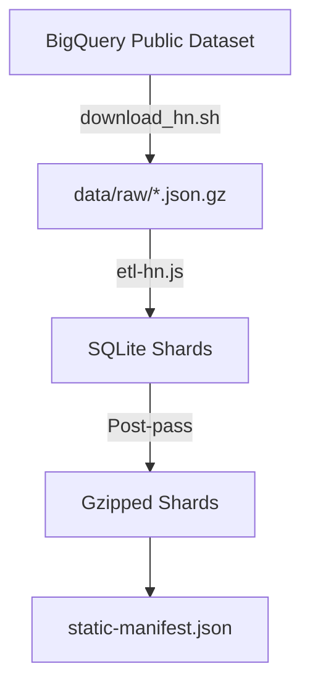
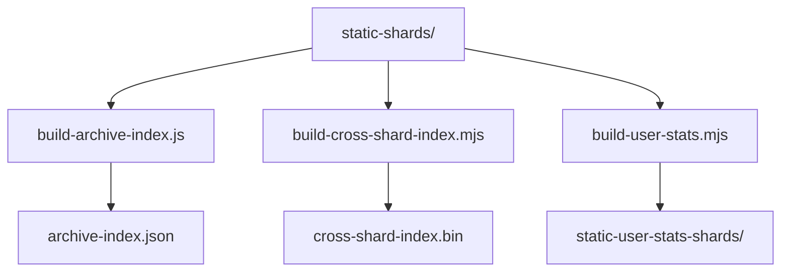

# Hacker Book - The unkillable, offline Hacker News archive, updated Weekly.

**Want to Sponsor daily updates? Ping me.**

    [](https://news.ycombinator.com/item?id=42550993) [](https://github.com/DOSAYGO-STUDIO/HackerBook/actions/workflows/daily-rebuild.yml)

did you miss hacker news for a day because you were occupied with something useful like work or you just didn't touch the Internet for sanity or purity? Well now you can go back to the days of hacker news that you missed and see what you missed using our weekly updated archive. updates come in around every Sunday. 

https://hackerbook.dosaygo.com

Community, all the HN belong to you. This repo packages 20 years of Hacker News into a **static** archive you can run entirely in your browser. The site is just files: HTML, JSON, and gzipped SQLite shards. No server app required.

- Demo: https://hackerbook.dosaygo.com
- Code: https://github.com/DOSAYGO-STUDIO/HackerBook


> [!NOTE]
> This project is an archive and a toolkit: run it locally, mirror it, or build your own daily snapshots.

## Table of contents
- [What this is](#what-this-is)
- [How it works](#how-it-works)
- [Screenshots](#screenshots)
- [Prerequisites](#prerequisites)
- [Quick start](#quick-start)
- [Repository layout](#repository-layout)
- [Pipeline overview](#pipeline-overview)
- [Restarting safely](#restarting-safely)
- [Shards and content hashing](#shards-and-content-hashing)
- [User stats shards](#user-stats-shards)
- [Index builders](#index-builders)
- [Architecture Decision: SQLite vs Parquet](#architecture-decision-sqlite-vs-parquet)
- [Tech deep dive](#tech-deep-dive)
  - [Data flow: BigQuery -> shards](#data-flow-bigquery---shards)
  - [Shard + index flow](#shard--index-flow)
  - [SQLite schema (items/edges)](#sqlite-schema-itemsedges)
  - [User stats schema](#user-stats-schema)
  - [BigQuery export schema](#bigquery-export-schema)
  - [Snapshot semantics](#snapshot-semantics)
- [Deploy checklist](#deploy-checklist)
- [Kiwix offline packaging](#kiwix-offline-packaging)
- [Contribute analysis](#contribute-analysis)
- [FAQ](#faq)
- [Notes](#notes)

## What this is
A fully static Hacker News archive that runs **entirely in your browser** using SQLite compiled to WebAssembly. The browser fetches only the shard files it needs for the page you are viewing, so the initial load is tiny and navigation stays fast.

> Community, all the HN belong to you. This is an archive of Hacker News that fits in your browser. The whole dataset. So they'll never die. Ever. It's the unkillable static archive of HN in your hands.

Inspired by HN Made of Primes, this is the "year-end gift" to the community: keep a durable, offline-friendly HN archive forever.

> [!TIP]
> The "organizing idea": **ship data like a static website**. Everything is a file. Everything is cacheable. Everything is yours.

## How it works
- **SQLite WASM in the browser** runs queries client-side.
- **The archive is sharded** into gzipped SQLite files so the browser can fetch only what it needs.
- **Manifests and indexes** describe where shards live and what they contain.
- **Content hashing** bakes a short SHA-256 into each shard filename for perfect cache correctness.

> [!IMPORTANT]
> The shards are immutable by filename. If content changes, the hash changes, and caches refresh automatically.

## Screenshots
**Query view**


**Me view**


## Prerequisites
- **Node.js 20+** (Required for tools and ETL)
- **Google Cloud SDK** (Required if using `download_hn.sh` to fetch raw data)
- **Disk Space**: ~45GB free (If running the full archivist workflow: 22GB raw + staging + shards)

## Quick start
Always run `npm install` once in the repo root.

### 1. Viewer Mode (Run locally)
Download the pre-built site to browse offline without building the database.
```bash
node toool/download-site.mjs
npx serve docs
# OR
python3 -m http.server 8000 --directory docs
```

### 2. Archivist Mode (Build from scratch)
Full pipeline: BigQuery -> ETL -> Shards.

```bash
# 1. Download raw data (Requires GCP configuration)
./download_hn.sh

# 2. Build shards and indexes
npm run etl

# 3. Finalize and serve
./toool/s/predeploy-checks.sh --restart-etl
npx serve docs
```

> [!TIP]
> Use `AUTO_RUN=1` for unattended pipeline runs. ✨

## Repository layout
- `docs/`: the static site (HTML, JS, CSS, manifests, indexes, shards)
- `docs/static-shards/`: gzipped item/comment shards
- `docs/static-user-stats-shards/`: user stats shards
- `data/`: raw dumps + staging DB
- `download_hn.sh`: BigQuery export helper
- `etl-hn.js`: main shard builder + post-pass
- `build-archive-index.js`: archive index builder
- `toool/s/`: scripts for predeploy, index builds, downloads

## Pipeline overview
1) **Raw data**: BigQuery exports in `data/raw/*.json.gz` (or `toool/data/raw/`).
2) **Staging (optional)**: imports into `data/static-staging-hn.sqlite`.
3) **Shard build**: write `.sqlite` shards in `docs/static-shards/`.
4) **Post-pass**: VACUUM, gzip, hash rename, manifest rewrite.
5) **Indexes**: archive, cross-shard, user stats.
6) **Deploy**: publish `docs/`.

`./toool/s/predeploy-checks.sh` runs the full pipeline with prompts.

Flags:
- `--use-staging` use `data/static-staging-hn.sqlite` instead of raw downloads.
- `--restart-etl` resume post-pass/gzip from existing shards and/or `.prepass`.
- `--from-shards` skip ETL; normalize shard hashes and rebuild from existing shards.
- `--hash-only` with `--from-shards`, only normalize shard hashes (skip post-pass).
- `AUTO_RUN=1` auto-advance prompts.

> [!WARNING]
> `--hash-only` assumes you already have gzipped shards. It will not gzip `.sqlite` files.

## Restarting safely
This pipeline is designed to tolerate interrupts.

- Kill only after a shard completes (`[shard N] ... file ...MB`).
- If killed mid-gzip, restart with: `./toool/s/predeploy-checks.sh --restart-etl`.
- The post-pass detects partial output and resumes from the last good shard.

## Shards and content hashing
**Items/comments shards** live in `docs/static-shards/`.

- Filenames are hashed: `shard_<sid>_<hash>.sqlite.gz`.
- `<hash>` is 12 hex chars (SHA-256 truncated).
- Hashing happens after VACUUM + gzip, so the hash represents the final bytes.

Why this matters:
- Cache correctness is automatic. If the shard changes, the URL changes.
- Old shards can be cached forever (`immutable`), while new snapshots fetch cleanly.

## User stats shards
User stats are separate shards optimized for usernames and monthly activity.

- Location: `docs/static-user-stats-shards/`
- Manifest: `docs/static-user-stats-manifest.json(.gz)`
- Tables: `users`, `user_domains`, `user_months`
- Built by: `node ./toool/s/build-user-stats.mjs --gzip --target-mb 15`

The build pipeline uses parallel workers to stream data from the staging DB, aggregating stats in-memory and flushing to size-capped SQLite shards.

The app switches to these shards for the `?view=me` view and when you select "User stats shards" in query mode.

## Index builders
- Archive index: `node ./build-archive-index.js`
- Cross-shard index: `node ./toool/s/build-cross-shard-index.mjs --binary`
- User stats: `node ./toool/s/build-user-stats.mjs --gzip --target-mb 15`

## Architecture Decision: SQLite vs Parquet

**Why SQLite sharding instead of Parquet with HTTP range requests?**

After analyzing all query patterns in HackerBook, we determined that SQLite is optimal for this use case. See [docs/ARCHITECTURE.md](docs/ARCHITECTURE.md) for the full analysis.

**TL;DR:**
- **40% of queries are point lookups** (`WHERE id=?`) - SQLite's B-tree indexes are 10-100x faster than Parquet
- **30% are Top-K sorted queries** with filters - SQLite's query optimizer excels at these
- **JOINs are critical** for comment threads - Parquet has no native JOIN support
- **Small result sets** (LIMIT 30-50) don't benefit from columnar storage
- **15MB shards** download in <1s and cache forever

Parquet would make sense for a supplementary "Data Export" feature for data scientists, but not for the interactive web UI.

## Tech deep dive
### Data flow: BigQuery -> shards


### Shard + index flow


### User stats pipeline
The user stats generation (`toool/s/build-user-stats.mjs`) is a high-performance pipeline designed to process 40M+ items efficiently:

1.  **Staging DB Source**: Reads directly from the `items_raw` staging table (indexed by `by, time`) instead of parsing raw JSON, significantly reducing I/O overhead.
2.  **Parallel Partitioning**: The user space is partitioned into equal chunks (by count) and processed by multiple worker threads in parallel.
3.  **Streaming Aggregation**:
    *   Workers stream items ordered by user.
    *   Stats (counts, scores, domains) are aggregated in-memory for the current user.
    *   Completed user records are flushed to the current SQLite shard.
4.  **Dynamic Sharding**: Shards are rotated automatically when they reach the target size (default 15MB), ensuring optimal download sizes.
5.  **Robustness**:
    *   **Memory Safety**: Automatically detects low heap limits and respawns with increased memory (8GB).
    *   **Transaction Safety**: Uses batched transactions for high-throughput writes.

### Manifests and Indexes Details
- **`static-manifest.json`**: The core routing map. It maps ranges of Item IDs (`id_lo` to `id_hi`) to specific shard files. The client uses this to perform binary searches when looking up a specific ID (e.g., `?id=123`). It is generated during the initial ETL sharding process.
- **`archive-index.json`**: A secondary map optimized for time-based access. It maps "effective" time ranges (`tmin_eff` to `tmax_eff`) to shards, filtering out data outliers. It also caches item counts (posts vs comments) to allow the UI to display daily statistics without opening every shard.
- **`static-user-stats-manifest.json`**: The directory for user data. It maps alphabetical ranges of usernames (e.g., "a" to "az") to specific user-stats shards, enabling fast lookups for the "Me" view.
- **`cross-shard-index.bin`**: A compact binary index (not JSON) that maps `parent_id` to a list of `shard_id`s. This solves the "scattered conversation" problem: if a story is in Shard A, but comments are added months later in Shard B and C, this index tells the client exactly which shards to fetch to load the full thread.

### Cross-shard index binary layout
The `cross-shard-index.bin` file uses a custom binary format for compactness (CSR-style):
- **Header (24 bytes)**: `CSHX` (magic), Version (u32), Parents Count (u32), Links Count (u32), Shard Count (u32), Reserved (u32).
- **Parent IDs**: Sorted array of `uint32` parent IDs (`parents_count * 4` bytes).
- **Offsets**: Array of `uint32` indices pointing into the Links array (`(parents_count + 1) * 4` bytes).
- **Links**: Array of `uint16` shard IDs (`links_count * 2` bytes).

### Cross-shard lookup logic
The index implements a **Compressed Sparse Row (CSR)** pattern using three parallel arrays:
1.  **Parent IDs**: A sorted list of story IDs that have cross-shard comments.
2.  **Offsets**: Pointers into the Links array. The shards for `ParentIDs[i]` are found in `Links` from index `Offsets[i]` to `Offsets[i+1]`.
3.  **Links**: A flat list of Shard IDs.

**To find shards for a given story:**
1.  Binary search `Parent IDs` to find the index `i` of the story ID.
2.  Read `start = Offsets[i]` and `end = Offsets[i+1]`.
3.  The relevant shards are `Links[start...end]`.

### SQLite schema (items/edges)
```
items(
  id INTEGER PRIMARY KEY,
  type TEXT,
  time INTEGER,
  by TEXT,
  title TEXT,
  text TEXT,
  url TEXT,
  score INTEGER,
  parent INTEGER
)

edges(
  parent_id INTEGER NOT NULL,
  ord INTEGER NOT NULL,
  child_id INTEGER NOT NULL,
  PRIMARY KEY(parent_id, ord)
)
```

### User stats schema
```
users(
  username TEXT PRIMARY KEY,
  first_time INTEGER,
  last_time INTEGER,
  items INTEGER,
  comments INTEGER,
  stories INTEGER,
  ask INTEGER,
  show INTEGER,
  launch INTEGER,
  jobs INTEGER,
  polls INTEGER,
  avg_score REAL,
  sum_score INTEGER,
  max_score INTEGER,
  min_score INTEGER,
  max_score_id INTEGER,
  max_score_title TEXT
)

user_domains(username TEXT, domain TEXT, count INTEGER)
user_months(username TEXT, month TEXT, count INTEGER)
```

### BigQuery export schema
```
SELECT id, title, by, score, time, type, text, url, parent
FROM `bigquery-public-data.hacker_news.full`
WHERE deleted IS NULL OR deleted = false
```

### Snapshot semantics
- The manifest records a **snapshot time** (latest item time in the dump).
- The UI normalizes to the snapshot **day end** (23:59:59) so the "front page" is always the final day of the dump.
- Cache-busting is applied to manifests and indexes; shards are immutable by hash.

## Deploy checklist
- `static-manifest.json(.gz)` updated and points to hashed shards.
- `archive-index.json(.gz)` updated.
- `cross-shard-index.bin(.gz)` updated.
- `static-user-stats-manifest.json(.gz)` updated.
- Cache-bust string bumped in `docs/index.html` and `docs/static.html`.
- **Verification**: Run `./toool/s/ci-verify.sh` to ensure core assets are in place.

## Kiwix offline packaging
Hacker Book is compatible with [Kiwix](https://kiwix.org), an offline content platform that allows you to browse the full HN archive without any internet connection.

### What is Kiwix?
Kiwix packages websites into ZIM files - compressed archives optimized for offline browsing. You can use Kiwix on smartphones (even "dumb phones"), tablets, and computers to access content offline.

### Creating a ZIM package
To package Hacker Book for Kiwix:

1. **Install zimwriterfs**:
```bash
# On Ubuntu/Debian
sudo apt-get install zimwriterfs

# On macOS
brew install zimwriterfs
```

2. **Build or download the site**:
```bash
# Option A: Download pre-built site
node toool/download-site.mjs

# Option B: Build from scratch
./toool/s/predeploy-checks.sh
```

3. **Create the ZIM file**:
```bash
zimwriterfs \
  --welcome=index.html \
  --favicon=cd.png \
  --language=eng \
  --title="Hacker Book - HN Archive" \
  --description="Complete offline Hacker News archive (2006-2025)" \
  --creator="DOSAYGO STUDIO" \
  --publisher="Community" \
  --name="hackerbook" \
  docs/ \
  hackerbook.zim
```

4. **Use with Kiwix**:
   - Install [Kiwix Desktop](https://www.kiwix.org/en/downloads/) or [Kiwix Android](https://play.google.com/store/apps/details?id=org.kiwix.kiwixmobile)
   - Open the `hackerbook.zim` file
   - Browse the full HN archive offline

### Distribution
Once created, the ZIM file can be:
- Shared via USB drives
- Distributed through [library.kiwix.org](https://library.kiwix.org)
- Hosted for download
- Used completely offline

> [!TIP]
> The ZIM file will be large (~9-10GB). Consider splitting it into smaller chunks for easier distribution or creating year-specific ZIM files.

## Contribute analysis
Have charts or analyses you want to feature? Email a link and a short caption to `hey@browserbox.io`. Bonus points for fresh takes and bold visualizations. 📊

## FAQ
**Is this really offline?**
Yes. Once the shards you need are cached, browsing is offline. You can also download the whole site and run it locally.

**How do I update the archive?**
Run `download_hn.sh`, then `./toool/s/predeploy-checks.sh` to rebuild shards and indexes.

**Why shards instead of HTTP Range requests?**
Shards are friendlier to static hosting and cache behavior, and make it easier to reason about data integrity.

**How big is it?**
The full archive is ~9GB gzipped (~22GB uncompressed), split across ~1.6k shards.

**Can I host this anywhere?**
Yes. Any static host works (Cloudflare Pages, S3, GitHub Pages, nginx, etc.).

## Notes
- Works best on modern browsers (Chrome, Firefox, Safari) with `DecompressionStream`; falls back to pako gzip when needed.
- Mobile layout is optimized for tap navigation and small screens.
- Viewer and ETL code are MIT-licensed.
- HN content remains property of Y Combinator and the respective authors.
- Roadmap: speed up user stats build (issue #3: https://github.com/DOSAYGO-STUDIO/HackerBook/issues/3).
- `_headers` sets long-cache + `immutable` for hashed shards and gz assets; manifests are cache-busted via HTML version strings.
